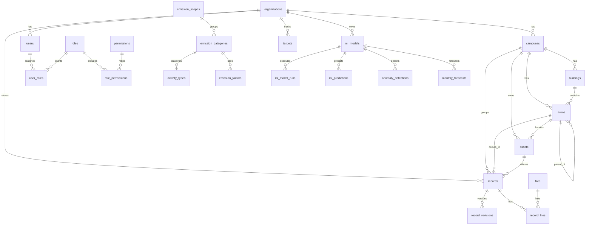

# Modelo de Base de Datos

## 1. Nivel conceptual

### Entidades principales

- `organizations`: institucion duena de la informacion.
- `campuses`: sedes o planteles de la organizacion.
- `buildings`: edificios por campus.
- `areas`: zonas funcionales o fisicas con jerarquia.
- `users`, `roles`, `permissions`: autenticacion y autorizacion.
- `units`, `metrics`, `data_sources`, `estimation_methods`, `fuel_types`: catalogos.
- `emission_scopes`, `emission_categories`, `activity_types`, `emission_factors`: nucleo del calculo ambiental.
- `assets`: medidores, vehiculos, equipos y otros activos.
- `records`: registro operativo principal de actividad o consumo.
- `record_revisions`, `audit_events`: trazabilidad e historial.
- `files`, `record_files`: evidencias y anexos.
- `targets`: metas institucionales.
- `exports`, `notifications`: operacion del sistema.
- `ml_models`, `ml_model_runs`, `ml_predictions`, `anomaly_detections`, `monthly_forecasts`: analitica y ciencia de datos.

### Relaciones principales

- una `organization` tiene muchos `campuses`;
- un `campus` tiene muchos `buildings`, `areas`, `assets`, `records`;
- un `building` tiene muchas `areas`;
- un `area` puede tener un `parent_area_id` y muchas subareas;
- un `user` pertenece a una `organization` y opcionalmente a un `campus`;
- `users` y `roles` se relacionan muchos a muchos mediante `user_roles`;
- `roles` y `permissions` se relacionan muchos a muchos mediante `role_permissions`;
- un `record` pertenece a una `organization`, `campus`, `area`, `scope`, `category`, `metric` y `unit`;
- un `record` puede apuntar a un `asset`, un `fuel_type`, un `activity_type`, un `emission_factor` y varias `files`;
- un `ml_model` puede generar muchos `ml_model_runs`, `ml_predictions`, `anomaly_detections` y `monthly_forecasts`.

## 2. Nivel logico

### Reglas de diseno

- todas las tablas tienen llave primaria clara;
- las relaciones criticas usan llaves foraneas compuestas cuando la pertenencia jerarquica importa;
- la mayoria del modelo se mantiene en 3FN;
- los catalogos se separan para evitar repetir texto libre;
- los datos derivados de alto valor operativo se guardan como columnas generadas o salidas analiticas controladas;
- la trazabilidad se maneja con bitacoras y revisiones, no con sobreescritura silenciosa.

### Convenciones

- nombres en `snake_case`;
- tablas en plural;
- PKs como `id`;
- FKs como `<tabla>_id`;
- fechas operativas con `date` cuando representan periodo;
- fechas de auditoria con `timestamptz`;
- JSON flexible solo donde la estructura futura no esta completamente cerrada.

### Modelado ML

- `ml_models.family` define la familia del modelo:
  - `xgboost`
  - `isolation_forest`
  - `prophet`
  - `custom`
- `ml_models.primary_use` define su uso principal:
  - `prediction`
  - `anomaly_detection`
  - `trend_forecast`
- `ml_model_runs` guarda entrenamiento, validacion, metricas y errores.
- `ml_predictions` guarda predicciones puntuales.
- `anomaly_detections` guarda eventos de anomalia revisables por usuario.
- `monthly_forecasts` guarda proyecciones mensuales para tendencia y planeacion.

## 3. Nivel fisico

### Decisiones de motor

- PostgreSQL por soporte fuerte de:
  - foreign keys reales;
  - `jsonb`;
  - `citext`;
  - `generated columns`;
  - exclusion constraints;
  - indices parciales y compuestos;
  - triggers y PL/pgSQL.

### Restricciones relevantes

- `CHECK` para cantidades no negativas, pares de campos obligatorios y rangos de fechas.
- `UNIQUE` para evitar duplicidad logica.
- FKs compuestas para impedir cruces invalidos entre organizacion, campus, area y categoria.
- exclusion constraint en `emission_factors` para evitar traslape de vigencias.

### Indices

Se incluyen indices sobre:

- PKs y FKs relevantes;
- filtros por fechas, scope, categoria, area y estado;
- auditoria por usuario y fecha;
- evidencia primaria por registro;
- factores de emision por categoria, metrica, unidad y vigencia;
- salida analitica por modelo y periodo.

### Diagrama de alto nivel

## 4. Cobertura del checklist de diseno

- entidades, atributos y relaciones: `cubierto`
- cardinalidades: `cubierto`
- llaves primarias y foraneas: `cubierto`
- normalizacion 3FN base: `cubierto`
- tipos de datos correctos: `cubierto`
- restricciones de negocio: `cubierto en esquema`
- indices segun consultas: `cubierto`
- crecimiento futuro sin sobrediseno: `cubierto`
- modelo de analitica/ML: `cubierto`
